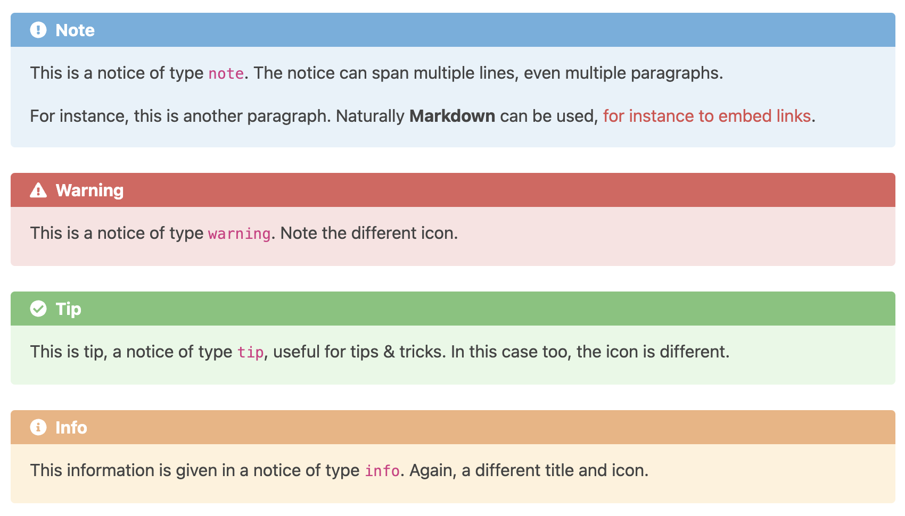

# hugo-notice

[](https://github.com/budparr/awesome-hugo)

## About

A [Hugo](https://gohugo.io) theme component providing a shortcode: `notice` to display nice notices, and supporting dark mode.

Several sets of icons are provided too: make your choice second your taste!

Four notice types are provided: `warning`, `info`, `note` and `tip`.

This component comes with __localization in 18 languages__: English, French, German, Italian, Portuguese, Spanish, Chinese, Russian, Turkish, Arabic, Polish, Finnish, Korean, Vietnamese, Swahili, Japanese, Chinese (Taiwan) and Swedish.

Other languages welcome! Send your pull request.



## Installation

### As a Hugo module

1. Initialize your existing site as hugo module

    ```shell
    hugo mod init github.com/USERNAME/REPO
    ```

2. Add the `hugo-notice` as a hugo module to be able to get upstream changes later

    ```shell
    hugo mod get github.com/martignoni/hugo-notice
    ```

3. In your site's or theme's configuration file `hugo.yaml` or `hugo.toml`, add a new `module` section and define both `hugo-notice` and your currently used theme as modules to be imported.

    Example, with `hugo.yaml`:
    ```yaml
    module:
      imports:
        - path: github.com/martignoni/hugo-notice
        - path: my-theme
    ```
    or, with `hugo.toml`,
    ```toml
    [module]
      [[module.imports]]
        path = "github.com/martignoni/hugo-notice"
      [[module.imports]]
        path = "my-theme"
    ```

### As a Git submodule

1. Add the `hugo-notice` as a submodule to be able to get upstream changes later `git submodule add https://github.com/martignoni/hugo-notice.git themes/hugo-notice`

2. Add `hugo-notice` as the left-most element of the `theme` list variable in your site's or theme's configuration file `hugo.yaml` or `hugo.toml`.

   Example, with `hugo.yaml`:
    ```yaml
    theme: ["hugo-notice", "my-theme"]
    ```
    or, with `hugo.toml`,
    ```toml
    theme = ["hugo-notice", "my-theme"]
    ```
## Usage

In your site, use the shortcode, this way:
```go

This is a warning notice. Be warned!

```
or
```go

This is a very good tip.

```

### Enabling dark mode

We recommend that you use the standard [`prefers-color-scheme`](https://developer.mozilla.org/en-US/docs/Web/CSS/@media/prefers-color-scheme) CSS media feature to detect if a user has requested light or dark color themes. In this case, dark mode will work automatically. The `prefers-color-scheme` media feature is fully supported by all modern browsers.

Another way to make it work is to inject (e.g. via Javascript) the class `dark` into the `body` element of your pages when dark mode is needed.

### Changing icon set

Just copy the icons from one of the subfolders of folder `icons/` into folder `icons/`.

Any __solid__ SVG icons can be used. If you want to contribute your open licensed icons, your pull request is welcome.

## Acknowledgements

Copyright © 2019 onwards, Nicolas Martignoni nicolas@martignoni.net.

### Localization

Thanks to
- [Geraldo Ribeiro](https://github.com/geraldolsribeiro) for the Portuguese localization.
- [thatrocketx](https://github.com/thatrocketx) for the Italian localization.
- [casaqori](https://github.com/casaqori) for the Spanish localization.
- [理头张](https://github.com/qidongz) for the Chinese localization.
- [Алексей Корнеев](https://github.com/korney4eg) for the Russian localization.
- [Ahmad Al Maaz](https://github.com/Music47ell) for the Turkish and Arabic localizations.
- [Rafal S.](https://github.com/sulik76) for the Polish localization.
- [Oskari J. Manninen](https://github.com/x7Gv) for the Finnish localization.
- [Haseop Lee](https://github.com/haservi) for the Korean localization.
- [Bùi Nguyễn Hoàng Thọ](https://discourse.gohugo.io/u/hoangtho97/summary) for the Vietnamese localization.
- [callaloo](https://github.com/callaloo) for the Swahili localization.
- [kevinzch](https://github.com/kevinzch) for the Japanese and Chinese (Taiwan) localizations.
- [mcfrojd](https://github.com/mcfrojd) for the Swedish localization.

### Development

Thanks to
- [Gary Tai](https://github.com/gary-tai) for raising a nasty spacing bug.
- [Dephilia](https://github.com/Dephilia) for suggesting and implementing dark mode.
- [RoneoOrg](https://github.com/RoneoOrg) for implementing default notice type.
- [Andreas Deininger](https://github.com/deining) for installation as a Hugo module How To.
- [rea1shane](https://github.com/rea1shane) for suggesting and implementing a few useful features.
